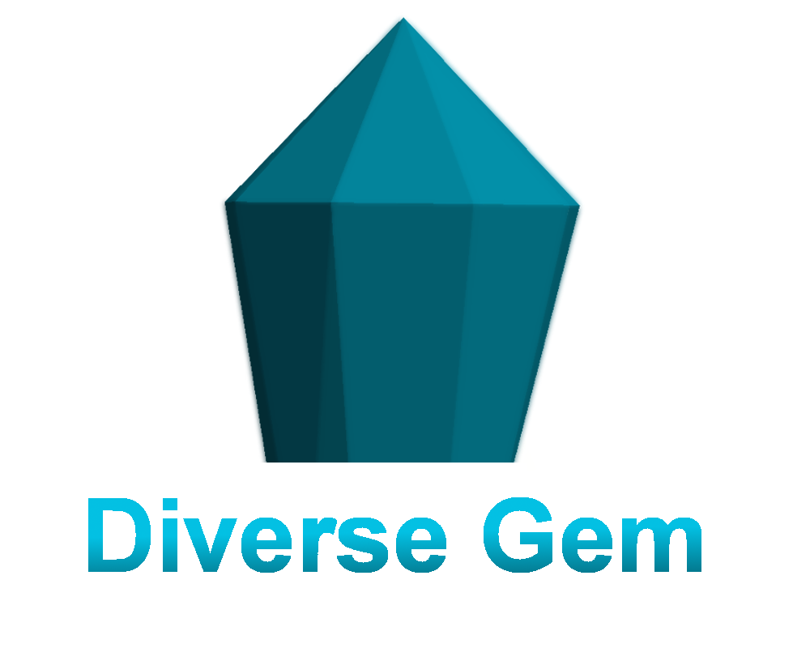
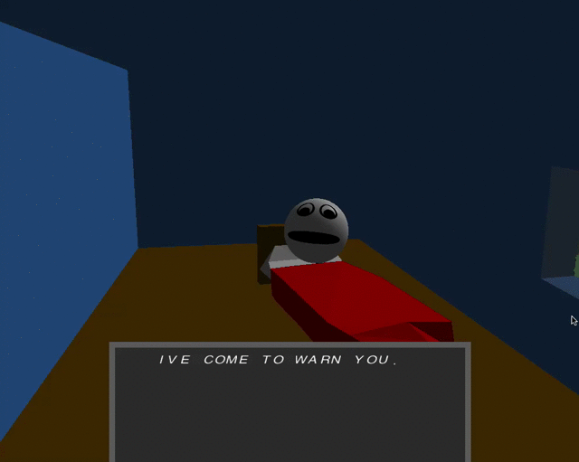
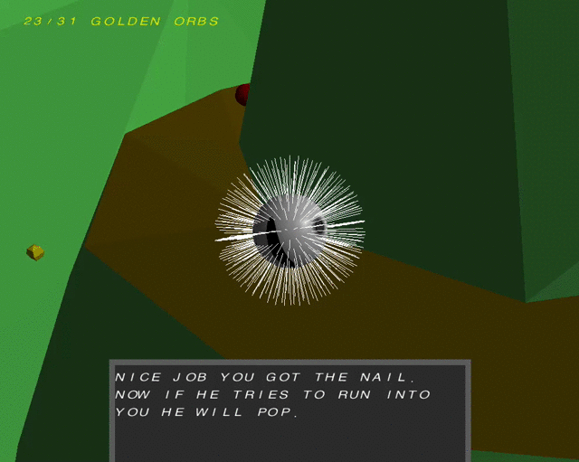

# DiverseGem

Created in 2014

## Description

I made this game in 2014 for a club competition in jr high, I had a little bit of help on some of the maps, and found a couple of resources online for sounds and music. This readme file has been written almost 10 years later, so I might miss a couple of things. Also keep that in mind if you play the game you will find various bugs and glitches, it was my first big project. Hope you enjoy!

## Installation and Setup

DiverseGem Runs on Java, you can download a version of the Java Runtime Environment 8u341 needed [here](https://www.oracle.com/java/technologies/javase/javase8u211-later-archive-downloads.html)

Once java is installed you can open the associated systems (windows64, mac, etc) .jar file.
The .jar files are located under /game 

if you don't clone the repository onto your computer, you can copy the associated .jar file onto your machine, make sure to download the ballroll folder and put the .jar and ballroll folder in same directory. 

## Gameplay controls

<kbd>W</kbd>, <kbd>A</kbd>, <kbd>S</kbd>, <kbd>D</kbd> - Move 
<kbd>Space</kbd> - Jump 
<kbd>esc</kbd> - pause menu 
_Mousewheel_ - change 3rd person perspective / 1st person perspective 

## Additional Controls

<kbd>Right Shift</kbd> - Screenshot in game 
<kbd>Y</kbd> - slow mo, though it hasn't really seemed all that slow mo, I think it has a modifier of 1.5 
<kbd>R</kbd> - Save power ball position 
<kbd>G</kbd> - Respawn power ball to last saved position 
<kbd>Y</kbd> + <kbd>L</kbd> - Reset level 

## Editor

To enter the editor press <kbd>0</kbd>, while the application is in the intro screen 

you can load up custom maps by putting a .ply file in /game/ballroll/maps 

if you want to load in specific schematics into the editor, go inside the /game/ballroll/schematics directory and put in a schematic there. It should be able to load .ply files 

### Editor Controls

Basic Controls 
<kbd>esc</kbd> - pause menu 
<kbd>W</kbd>, <kbd>A</kbd>, <kbd>S</kbd>, <kbd>D</kbd> - Move horizontally 
<kbd>left shift</kbd> - Move down vertically 
<kbd>space</kbd> - Move up vertically 
<kbd>H</kbd> - put the ball position at the position of the editor cursor 
<kbd>U</kbd> - change between edit and play mode 

Cursor Controls 
<kbd>F</kbd> - add a vertex at the cursor position, add 3 and you'll create a triangle 
<kbd>G</kbd> - delete nearest triangle 
<kbd>R</kbd> - reset the current triangle you are creating, (example if you push f twice push R to reset and not comlete the triangle) 
<kbd>E</kbd> - Snap editor cursor to nearest edge, hold to stay snapped to that edge 
<kbd>Q</kbd> - Snap to nearest vertex, or the nearest mid point of a triangle 

Surface Properties 
_You can find the surface color properties if you hover you mouse near the bottom of the pause screen, just push <kbd>esc</kbd> to get there. The left three sliders are for R,G,B from top to bottom, the top right slider is the alpha value, the bottom right slider is your cursor speed._ 
<kbd>'</kbd> - set color editing properties to the properties of the gravity crystal 
<kbd>Z</kbd> - flip the surface normal 
<kbd>T</kbd> - set the editor color selection to the nearest triangle 
<kbd>O</kbd> - set the nearest triangle to the current editor color selection 
<kbd>K</kbd> - smooths the normals of connected triangles at a specific position 

Schematic Controls 
You can find the schematic editor in the paused menu, in the top right it will be a blue button, click on that and you will find schematics you can load in, load one up and push <kbd>esc</kbd> to exit the pause menus  
<kbd>,</kbd> (comma) - clear the currently loaded schematic 
<kbd>.</kbd> (period) - load up a shape as the schematic 
<kbd>V</kbd> - paste in the currently loaded schematic, (you'll know when a schematic is loaded as it will appear transparent at the cursor) 
<kbd>Left Arrow</kbd>,<kbd>Right Arrow</kbd> - rotate the schematic 
<kbd>Down Arrow</kbd>, <kbd>Up Arrow</kbd> - scale the schematic 

Item Editor Controls 
<kbd>N</kbd> - Create new Item 
<kbd>1</kbd> - Edit closest item's type 
<kbd>M</kbd> - remove closest item 

Fun Additions 
<kbd>I</kbd> - spawn small particles at the cursor 
<kbd>P</kbd> - spawn a firework at the cursor 
<kbd>/</kbd> - render lightning from cursor to player 
<kbd>semi-colon</kbd> - rotate the viewport around the z-axis (y-axis in other engines) 

## Screenshots

 Uses a version of LWJGL-2.9.1 
